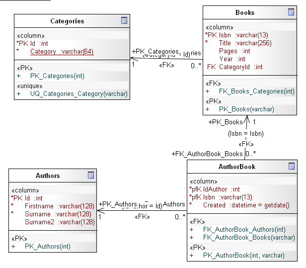

# Stored Procedures in MS SQL Server

Stored procedures offer many advanced features not available in the standard SQL language. The ability to pass parameters and perform logic allows the application designer to automate complex tasks. In addition, these procedures being stored at the local server reduces the amount of bandwidth and time required to execute the procedure.

There are several advantages to writing your own procedures, first you are able to write complex SQL statements into the procedure, second, to execute those SQL statements, all the user has to do is to run the procedure.
With the use of parameters, you can make your stored procedures much more useful as well as powerful. The following sample database, will show you the syntax for creating some stored procedures for CRUD operations.

<b>Fig 1. E-R Diagram for the sample database</b>

There is also a security advantage to using stored procedures. After the stored procedure has been created, all access to the underlying tables can be revoked to the users.

<h3>Reading Data with Stored Procedures</h3>

The following stored procedure [usp_get_authors_storebook] creates a stored procedure to return all authors in the table.
After you create this stored procedure, you will execute it by running the following statement:

<pre>
use BookStore
exec dbo.usp_get_authors_storebook
</pre>
This will return the authors which Surname is equal to 'Deitel'. One of the problems is that if you do not pass it one of the parameters that is expecting, you will get an error. One way to get around this is to set up the parameters to use a default value.

<h3>Adding Data with Stored Procedures</h3>
<b>The OUTPUT Parameter</b>
The OUTPUT parameter is a very special type of parameter. It allows you to return data directly into a variable that can be used in other processing. The value that is returned is the current value of that parameter when processing of the stored procedure completes.
The following stored procedure [[usp_add_book_storebook]] shows how to create a simple store procedure that utilizes the OUTPUT keyword:
To execute this store, run the following script:

<pre>
use BookStore
declare @presult varchar(13)
declare @pmsgerror varchar(256)
set @presult = null
set @pmsgerror = null
EXEC dbo.usp_add_book_storebook '0764576593'
					,'JavaScript for dummies'
					,387
					,2005
					,1
					,@presult output
					,@pmsgerror output
if @presult = null
print @pmsgerror
else
print 'Id ' + convert(varchar(13),@presult) + ' added'
</pre>

<h3>Modifying Data with Stored Procedure</h3>
Stored procedures can also be used to modify data. Any valid insert, update or delete can be made into a stored procedure and can be run by executing a single line of code instead of running many lines of code.
The following stored procedure [usp_delete_book_storebook] will delete a book and erase all its relations in the table [Authorbook]
To test this store run the following script.
<pre>
declare @presult bit = 0
declare @pmsgerror varchar(256) = null
EXEC dbo.usp_delete_book_storebook '0764576593'
					,@presult output
					,@pmsgerror output
if @presult = 0
print @pmsgerror
else
print 'Id ' + convert(varchar(13),@presult) + ' deleted'
</pre>

